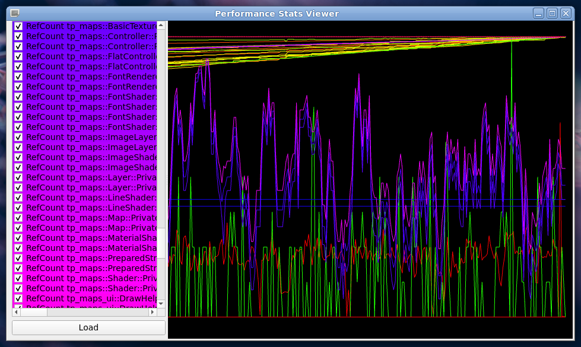

# Viewer For Stats Generated by tp_utils::KeyValueLogStatsTimer
This program can be used to graph stats generated by tp_utils::KeyValueLogStatsTimer.



## Prerequisites 
* [General machine installation](https://github.com/tdp-libs/general_machine_installation)
* tp_tools [Installation instructions](https://github.com/tdp-libs/tp_tools)
* A toolchain for your chosen platform. [Installation instructions](https://github.com/tdp-libs/tp_build)
* Qt Creator

## Clone Instructions
These steps will clone the repo and all of its dependencies. You will need tp_tools in your path for 
this to work.
```
mkdir performance_stats_viewer
cd performance_stats_viewer
git clone https://github.com/tdp-libs/general_performance_stats_viewer.git
cp general_performance_stats_viewer/performance_stats_viewer.pro .
tpUpdate

```

## Include and Library Paths
Depending on your platform you may need to specify include and library paths. The previous steps 
should have created a `performance_stats_viewer/project.inc` file, this can be modified to add 
platform specific include and library paths. If these modifications may be of use to someone else 
then they can be added to the project.inc file found in 
`performance_stats_viewer/general_performance_stats_viewer/` directory.

## QMake Build Instructions
To build and deploy the application using QtCreator perform the following steps.
1. Open the top level performance_stats_viewer.pro file in QtCreator.
2. Select a kit.
3. Edit `performance_stats_viewer/project.inc` to suit your system.
4. Click the green arrow in the bottom left to build and run.
5. Set you run env vars, see below.
